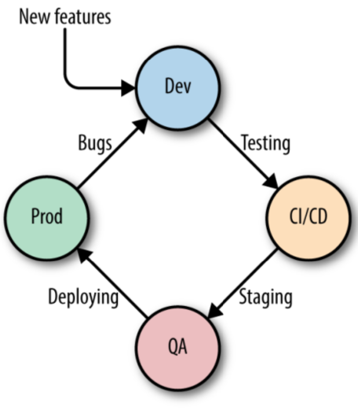
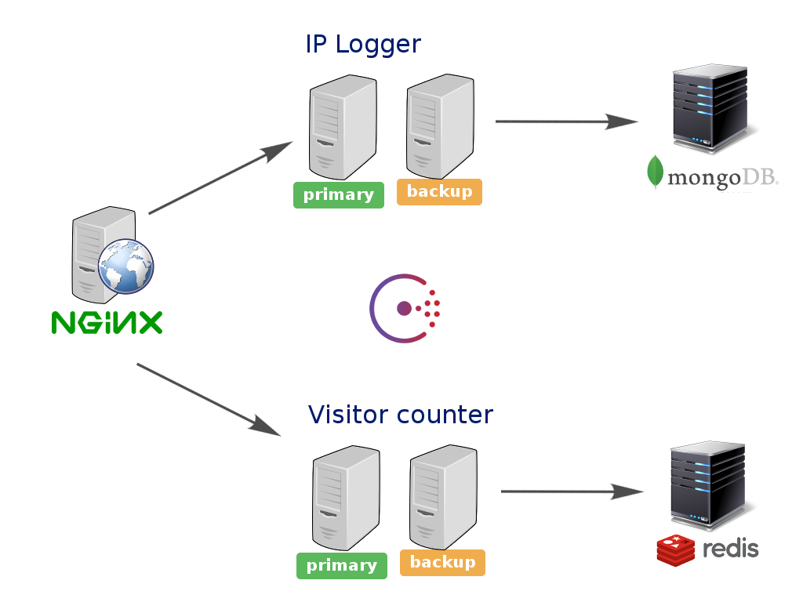

# Platform as a Service (PAAS)

Note: (0) Mardown custom syntax: "--- and newline" for vertical slide transiction, "-- and newline" for horizontal slide transiction ; (1) These slides are "Column" based (down and right versus). Just press space to follow the rigth order.

---

## Overview

### key factors

- reproducibility
- automation
- orchestration
- isolation
- safe deployment

---

```...PaaS platforms provide higher level programming abstractions and frameworks, they can accelerate development of new cloud-based applications and migration of existing SaaS applications to the cloud. These advantages, however, come at some cost to the developer. Balancing costs and benefits points the way to use cases when the use of PaaS is appropriate and when it is not...
```

<http://bulgerpartners.com/the-benefits-and-challenges-of-platform-as-a-service>

---

### Why? Continuous Integration


<https://github.com/francescou/docker-continuous-deployment>

---

### *Primary/Backup* deployment


---

### It's a Containers choice
 - Docker
 - Rocket
 - LXD
 - Warden and Garden
 - Others …

---

### Containers & C.I.

Automation building system like can deploy images to
 - Microservices: Automation
 - Pipeline: Lyfecycle
 - VCS: Integration

---

### Aims

 - Shortest **Time To Market**
 - Pay only for used **resources**
 - **Easy** user experience
 - **Standard** and shareable technologies

---

### Why containers?
 - **Scalable** Infrastructure
 - **Orchestration**
 - Decentralization and **hybrid** architectures
 - Rapid **error proof** updates for app and platform
 - **Portability** and virtualization benefit

---

### What can containers do?
 - High **density**: 1 VM = dozens Containers
 - Only user **Persitent Data** as valuable backup purpose data
 - Network, Computing and Storage **Software Defined** 
 - Containers: security by **isolation** *(0)* *(1)*
 - Integration with modern **Infrastructure as a Service** stacks
 - Integration with modern **Logging and Metrics** services stacks

---

### Notes on Security

- *(0)*  Adding virtualization to container's security is greatly increased (es: LXD)

- *(1)*  Production and Enterprise containers based PaaS integrate O.S. security feature, like Selinux and user privileges separation over containers isolation to elevate security

--

## Open Shift PAAS

opensource / docker based / enterprise support


---

### Open Shift ORIGIN

- architecture
- planning
- caveat
- allinone demo

---

## Architecture (Global View)


---


### Main Roles


---

### Inner components


---

### DEMO (todo)
- placeholder
[DEMO](images/01-forema_swarm_deploy.webm)

